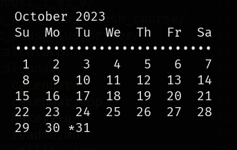

# Calendar



### Clone

```
$ git clone git@github.com:brandon-wallace/calendar.git

$ cd calendar/
```

### Compile

```
$ make clean
```

```
$ make
```

### Run

```
$ ./calendar
```

### Debug

```
$ make debug
```
